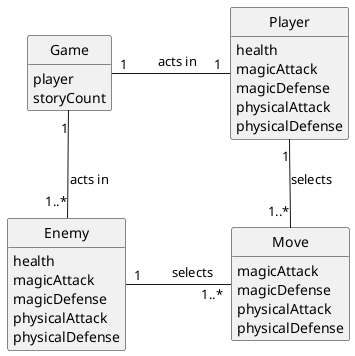
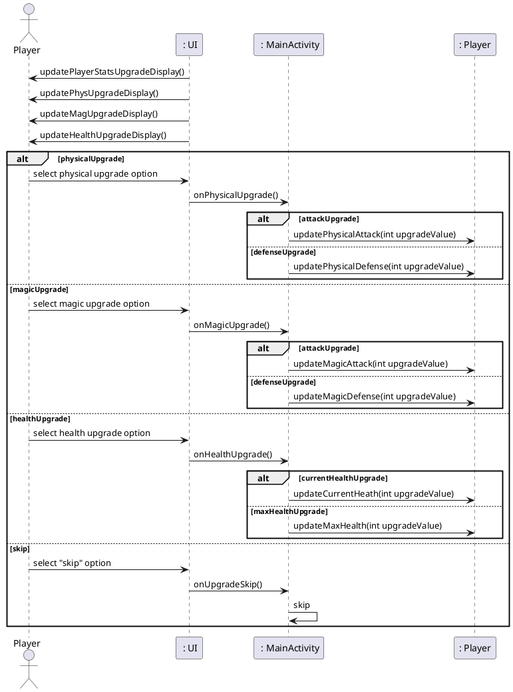
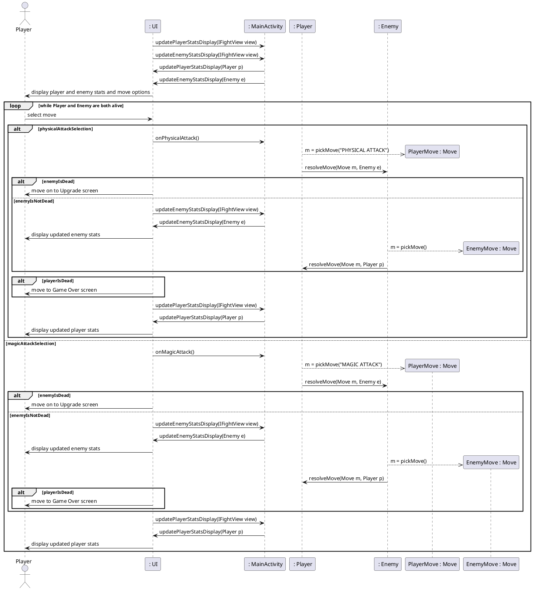
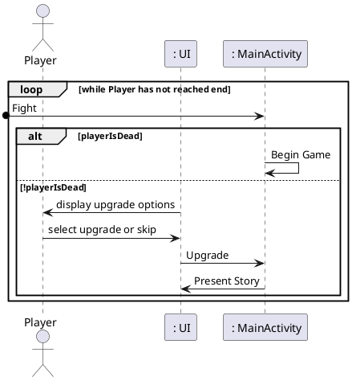
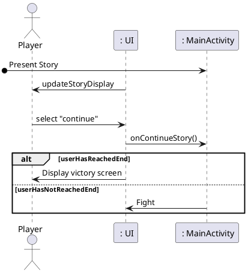
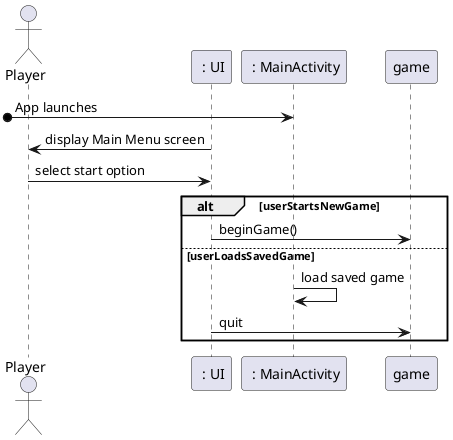
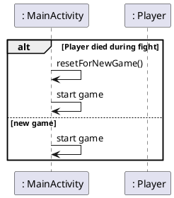
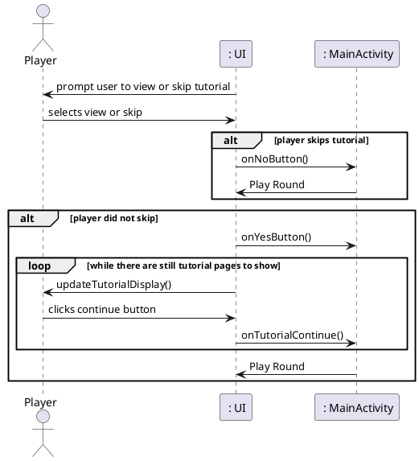
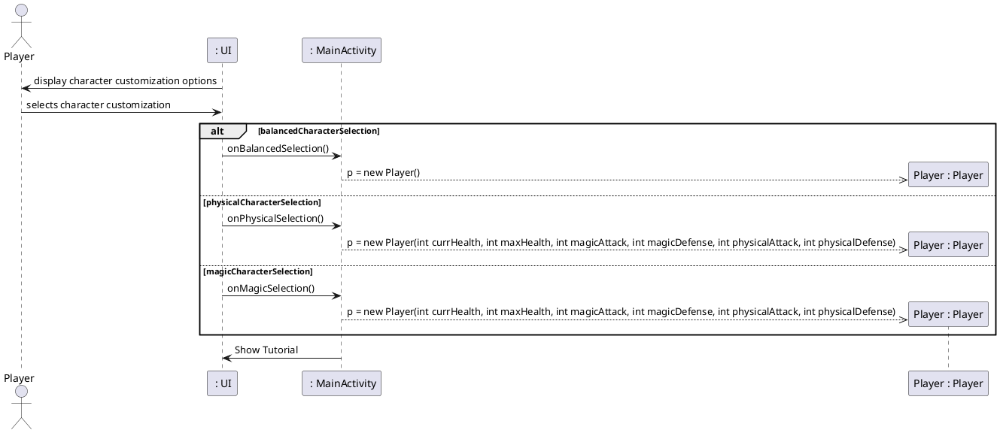
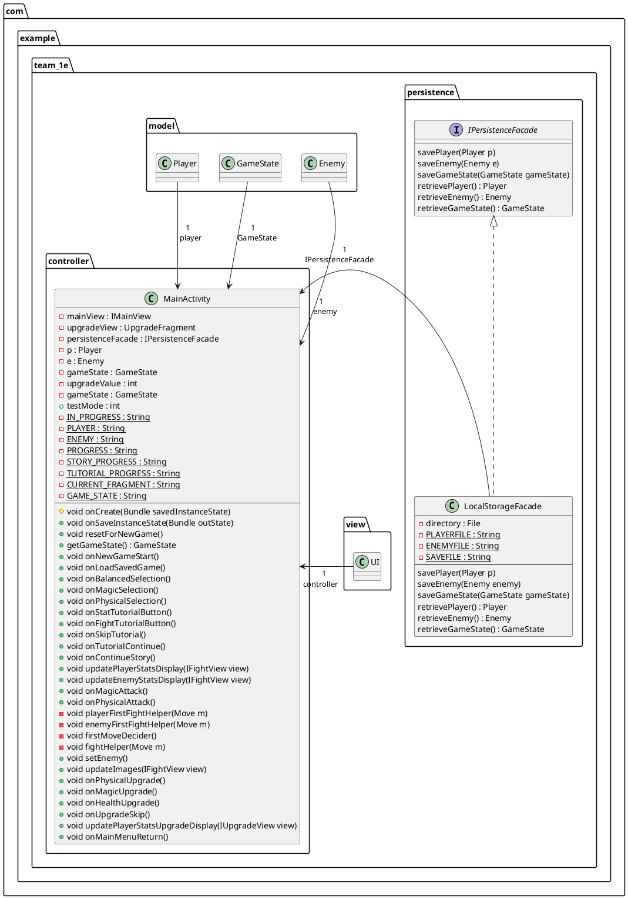

## Domain Model


## Sequence Diagram for the Upgrading process


## Sequence Diagram for Fight use case


## Sequence Diagram for Play round use case

## Sequence Diagram for the Present Story use case


## Sequence Diagram for the Start App use case


## Sequence Diagram for Begin Game use case


## Sequence Diagram for Show Tutorial use case


## Sequence Diagram for Customize Character use case


## Class Diagram

```plantuml
package com.example.team_1e.model{
abstract class APlayer{
- currentHealth: int
- maxHealth: int
- magicAttack: int
- magicDefense: int
- physicalAttack: int
- physicalDefense: int
- image: int
--
+ resolveMove(Move m, APlayer a) : int
+ toString() : String
+ getCurrentHealth() : int
+ upgradePhysicalAttack(int upgradeValue) : int
+ upgradePhysicalDefense(int upgradeValue) : int
+ upgradeMagicAttack(int upgradeValue) : int
+ upgradeMagicDefense(int upgradeValue) : int
+ upgradeCurrentHealth(int upgradeValue) : int
+ upgradeMaxHealth(int upgradeValue) : int
+ getImageTracker() : int
+ getPhysicalAttack() : int
+ getPhysicalDefense() : int
+ getMagicAttack() : int
+ getMagicDefense() : int
+ getMaxHealth() : int
}

class Player{
--
+ pickMove(String s) : Move
}

class Enemy{
--
+ pickMove() : Move
}

class Boss{
}

class EasyBalEnemy{
}

class EasyMagicEnemy{
+pickMove(String s) : Move
}

class EasyPhysicalEnemy{
+pickMove(String s) : Move
}

class HardBalEnemy{
}

class HardMagicEnemy{
+pickMove(String s) : Move
}

class HardPhysEnemy{
+pickMove(String s) : Move
}

class MiniBoss{
}

Enemy <|-- Boss
Enemy <|-- EasyBalEnemy
Enemy <|-- EasyMagicEnemy
Enemy <|-- EasyPhysicalEnemy
Enemy <|-- HardBalEnemy
Enemy <|-- HardMagicEnemy
Enemy <|-- HardPhysicalEnemy
Enemy <|-- MiniBoss

Boss -up-.> Move
EasyBalEnemy -up-.> Move
EasyMagicEnemy -up-.> Move
EasyPhysicalEnemy -up-.> Move
HardBalEnemy -up-.> Move
HardMagicEnemy -up-.> Move
HardPhysicalEnemy -up-.> Move
MiniBoss -up-.> Move

Player -> "1\t\t                \nplayer\t\t\t\t \n\n" com.example.team_1e.controller.MainActivity
Enemy --> "1 \n\t\tenemy\t\t\t" com.example.team_1e.controller.MainActivity 
'associations because Player and Enemy are data types defined in this project

com.example.team_1e.controller.MainActivity -> "\n\n1 \nGameState" GameState: \t\t

class Move{
- magicAttack: int
- physicalAttack: int
--
+ getMagicAttack() : int
+ getPhysicalAttack : int
+ equals(Object o) : boolean
}

class GameState{
- progress : int
- storyProgress : int
- tutorialProgress : int
- curFrag : String
- firstMover : String
---
+ getProgress() : int
+ getStoryProgress() : int
+ getTutorialProgress() : int
+ getCurFrag() : String
+ getFirstMover() : String
+ setProgress(int progress)
+ setStoryProgress(int storyProgress)
+ setTutorialProgress(int tutorialProgress)
+ setCurFrag(String curFrag)
+ setFirstMover(String firstMover)
+ addOneProgress()
+ addOneStoryProgress()
}
APlayer <|-- Player
APlayer <|-- Enemy
Player -up-.> Move
Enemy -up-.> Move

}
```
```plantuml
package com.example.team_1e.view{
    interface ICharacterCustomizationView{
        --
        Listener:
            onBalancedSelection()
            onPhysicalSelection()
            onMagicSelection() 
    }
    
    interface IFightView{
        updatePlayerStatsDisplay(Player p)
        updateEnemyStatsDisplay(Enemy e)
        updateImages(Player p, Enemy e)
        --
        Listener:
            updatePlayerStatsDisplay(IFightView view)
            updateEnemyStatsDisplay(IFightView view)
            onMagicAttack()
            onPhysicalAttack()
            setEnemy()
            updateImages(IFightView view)
    }
    
    interface IGameOverView{
        --
        Listener:
        onMainMenuReturn()
    }
    
    interface IMainMenuView{
        --
        Listener:
        onNewGameStart()
        onLoadSavedGame()
    }
    
    interface IMainView{
        getRootView() : View
        displayFragment(Fragment fragment, boolean reversible, String name)
        updateProgressText(int progress)
        setProgressTextInvisible();
        setProgressTextVisible();
        displayMessage(String msg)
    }
    
    interface ISeeTutorialView{
        --
        Listener:
        onStatTutorialButton()
        onFightTutorialButton()
        onUpgradeTutorialButton()
        onSkipTutorial()
    }
    
    interface IStoryView{
        updateStoryDisplay()
        --
        Listener:
        onContinueStory()
        getGameState : GameState
    }
    
    interface ITutorialView{
        updateTutorialImage()
        --
        Listener:
        onTutorialContinue()
        getGameState(): GameState
    }
    
    interface IUpgradeView{
        updatePhysUpgradeDisplay()
        updateMagUpgradeDisplay()
        updateHealthUpgradeDisplay()
        getPhysUpgrade() : double
        getMagUpgrade() : double
        getHealthUpgrade() : double
        updatePlayerStatsUpgradeDisplay(Player p)
        --
        Listener:
        onPhysicalUpgrade()
        onMagicUpgrade()
        onHealthUpgrade()
        onUpgradeSkip()
        updatePlayerStatsUpgradeDisplay(IUpgradeView view)
    }
    
    interface IVictoryView{
        --
        Listener:
        onMainMenuReturn()
    }
}
```
