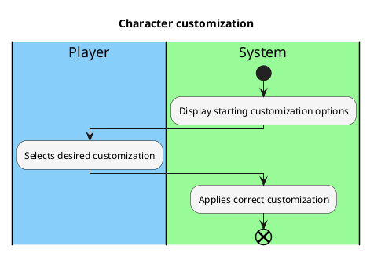

# Customize character

### Priority:
- Low
### Level:
- User Goal
### Primary Actor:
- Player 
### Stakeholders and interests:
- Player: wants to have clear options to pick from to create their character
### Preconditions:
- Player has started a game
### Postconditions:
- The player's starting stats are correct according to the chosen character class
### Workflow:

### Non-functional requirements
- #### Usability
  - Ui is readable, options are clear
- #### Performance
  - Character is created correctly based on player's choices, creation is fast
- #### Legal
  - No copyright infringements in images