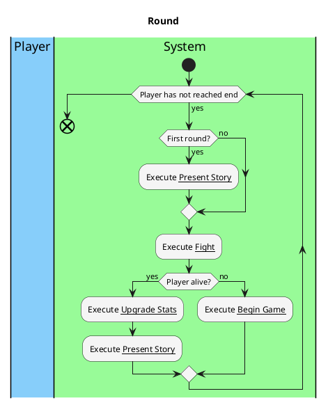

# Play round

### Priority
- High 
### Level
- Subfunction 
### Primary Actor
- System
### Stakeholders and interests
- Player: wants the game to run in the correct order without delays
### Preconditions
- Player has started a game and has not reached the end of the game
### Postconditions
- A fight has occurred. If the player is alive after the fight, they have the chance to upgrade their stats and see a story fragment. If the player died during the fight, they are returned to the beginning.
### Workflow:

### Non-functional requirements
- #### Usability
  - Order of the game makes sense
- #### Performance
  - Player does not need to wait for each part of the game to occur
- #### Legal
  - No copyright infringements in images