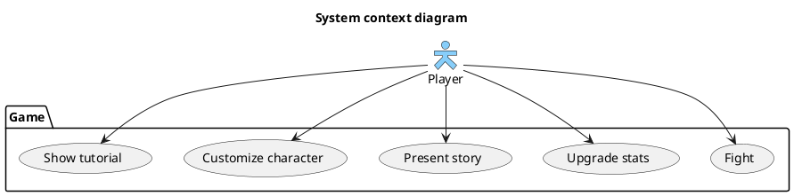

# Vision Document

## Introduction
We envision a single-player combat-based adventure game in either the 
“roguelike” style or a similar one. Players will progress through a series 
of turn-based combats, uncovering pieces of a story and upgrading 
their character along the way. If the player's character dies, they will restart from the beginning. 
The game has five statistics: **Physical attack**, **Physical defense**, **Magic attack**, 
**Magic defense**, and **Health**. The player can affect each of these statistics through combat 
and upgrades during story interactions.

## Business Case

Our game has a variety of features that keep it engaging for users:
- Our multiple-stat turn-based combat mechanics are simple to learn but require some thought
- The user uncovers new story elements and faces new enemy types as they progress
- Character customization and upgrade options encourage specialization, providing an extra challenge if users wish to try all possibilities

## Key Functionality

- Turn-based combat mechanics utilizing two separate stats
- Upgrade options prevent the game from remaining the same each time
    - Each opportunity to upgrade has three options: one upgrades Physical attack or defense, one upgrades Magic attack or defense, and one increases current or max Health
- Story which progresses along a fixed path as the character wins successive combats
- Character customization options (details to be determined later)

## Stakeholder Goals Summary

- Player: fight combats, unlock new story elements, upgrade stats

## System context diagram

