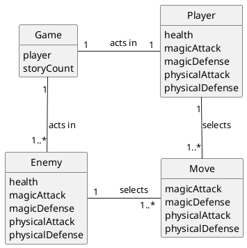
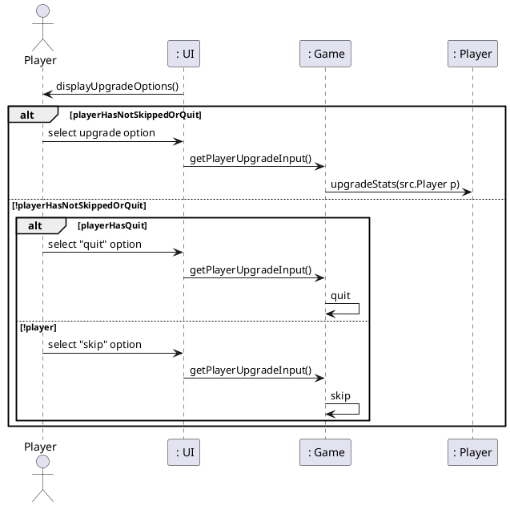
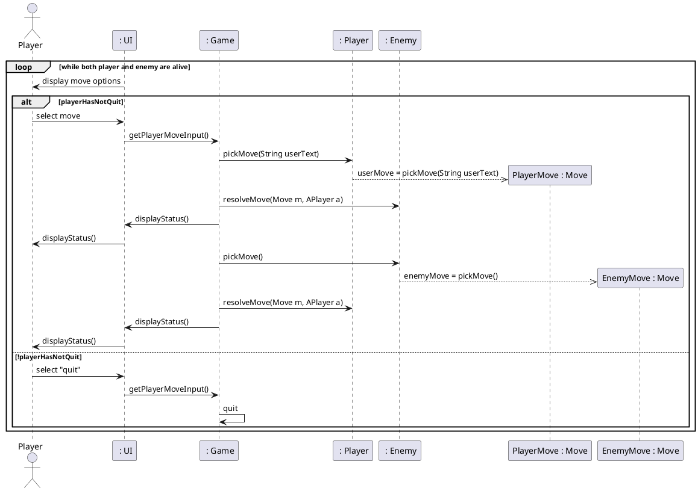
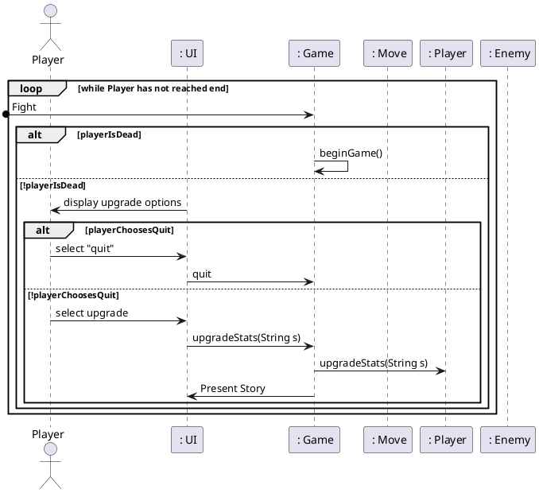
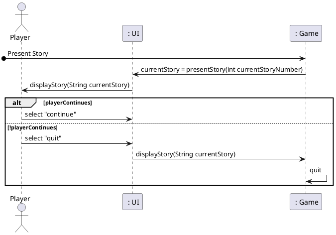
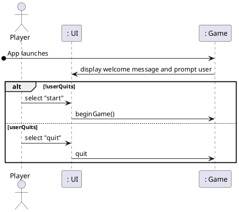
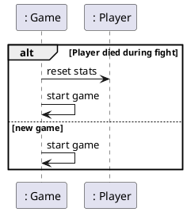
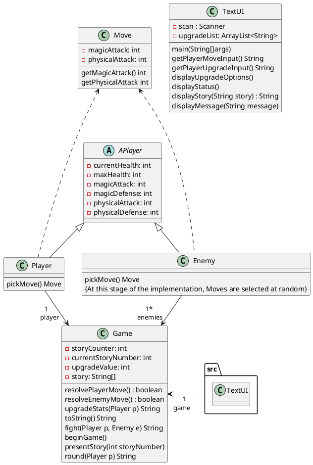

## Domain Model

## Sequence Diagram for the Upgrading process

## Sequence Diagram for Fight use case

## Sequence Diagram for Play round use case

## Sequence Diagram for the Present Story use case

## Sequence Diagram for the Start App use case

## Sequence Diagram for Begin Game use case

## Class Diagram

