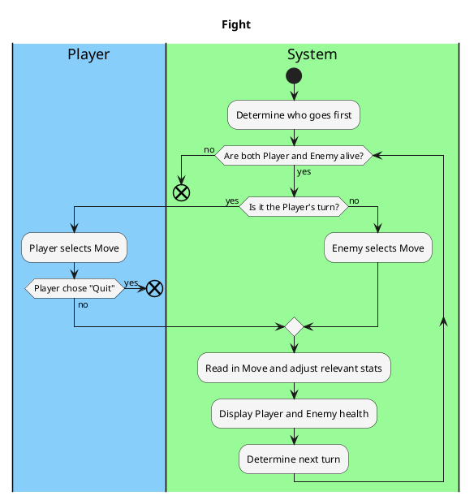

# Fight

### Priority: 

- High

### Level: 

- User Goal

### Primary Actor: 

- Player

### Stakeholders and Interests:

- Player: Wants fast, smooth, easy to operate, and enjoyable gameplay without having to wait too long between rounds.

### Preconditions:

- Player is alive.

### Postconditions:

- Player is either victorious or dead.

### Workflow:

### Non-Functional Requirements:
- #### Usability:
  - Intuitive UI that is easily understandable by the Player.
- ### Performance:
  - System picks Enemy move within a few seconds at most.
- ### Legal:
  - No copyright infringements in images used.