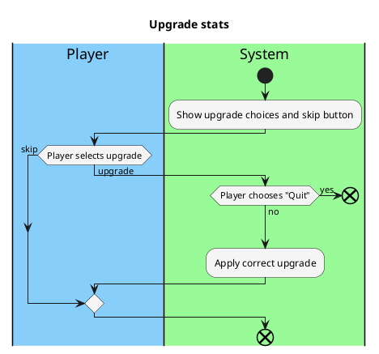

# Upgrade stats

### Priority:
- High

### Level:
- User goal

### Primary Actor:
- Player

### Stakeholders and Interests
- Player: wants clear options, wants options that improve their character, wants fast processing

### Preconditions:
- Player has survived fight

### Postconditions:
- Player's stats have changed according to upgrade they chose

### Workflow:

### Non-Functional Requirements:
- ### Usability:
  - Readable UI, resulting change is clear from UI
- ### Performance:
  - Player does not need to wait for stats to change, stats change properly
- ### Legal:
  - No copyright infringements in images