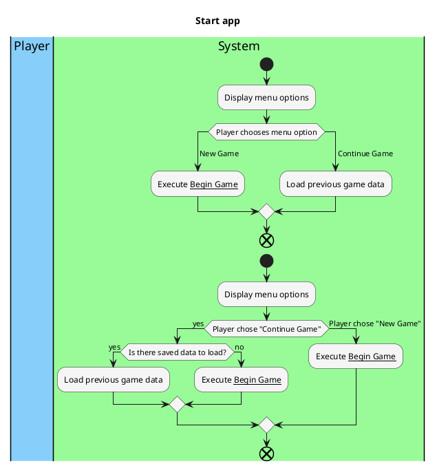

# Brief Use Cases

### Show tutorial:
- Priority:
  - Medium
- Level: 
  - User Goal
- Primary Actor:
  - Player
- Postconditions:
  - All sections of the tutorial have been sequentially shown to the player
- Workflow:
  - ```plantuml
    @startuml
    |#LightSkyBlue|Player|
    |#PaleGreen|System|
    ' Sets up colors for the activities and symbols
    skinparam activity{
      BackgroundColor WhiteSmoke
      EndColor Black
    } 
    title Tutorial
    |System|
    :Show skip tutorial prompt;
    |Player|
    if (Player skips) then (skip)
    |System|
    else (show tutorial)
    while (Is there more tutorial to show?) is (yes)
    |Player|
    :Player requests next page;
    |System|
    :Display next tutorial element;
    endwhile (no)
    endif
    :Execute __Play Round__;
    end
    @enduml
    

### Present story:
- Priority:
  - High
- Level: 
  - Subfunction
- Primary Actor:
  - System
- Postconditions:
  - The next phase of the story has been displayed and the story progress tracker has been updated
- Workflow:
  - ```plantuml
    @startuml
    |#LightSkyBlue|Player|
    |#PaleGreen|System|
    ' Sets up colors for the activities and symbols
    skinparam activity{
      BackgroundColor WhiteSmoke
      EndColor Black
    }
    title Story interactions
    |System|
    start
    :Check story counter;
    :Display correct story interaction;
    if (Does the player want to quit?) then (no)
    |Player|
    :Player presses continue;
    else (yes)
    |System|
    :Exit program;
    end
    endif
    |System|
    :Update story counter;
    end
    @enduml
    
    

### Customize character:
- Priority:
  - Low
- Level:
  - User Goal
- Primary Actor:
  - Player
- Postconditions:
  - The player's starting stats are correct according to the chosen character class
- Workflow:
  - ```plantuml
    @startuml
    |#LightSkyBlue|Player|
    |#PaleGreen|System|
    ' Sets up colors for the activities and symbols
    skinparam activity{
       BackgroundColor WhiteSmoke
       EndColor Black
    }
    title Character customization
    |System|
    start
    :Display starting customization options;
    |Player|
    :Selects desired customization;
    |System|
    :Applies correct customization;
    end
    @enduml
    

### Start app
- Priority:
  - Medium
- Level:
  - User Goal
- Primary Actor:
  - Player
- Postconditions:
  - Player sees first story fragment and gameplay starts


